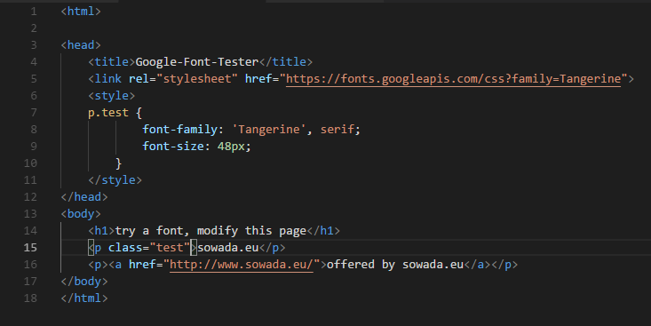
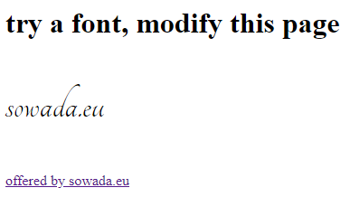

# google-font-tester

## description

small simple file to test [Google-Fonts](https://fonts.google.com/) to display on your local browser, you may modify or extend this file. In HTML or CSS.

use the [guideline](https://developers.google.com/fonts/docs/getting_started) of Google.

## screenshots

## usage

edit the file: google-fonts.html in any editor

- modify the font
- modify your text
- watch the modified html in your Web-Browser

## author

Karl Sowada from [sowada.eu](http://www.sowada.eu/) an engineer buero located in Reutlingen, Germany